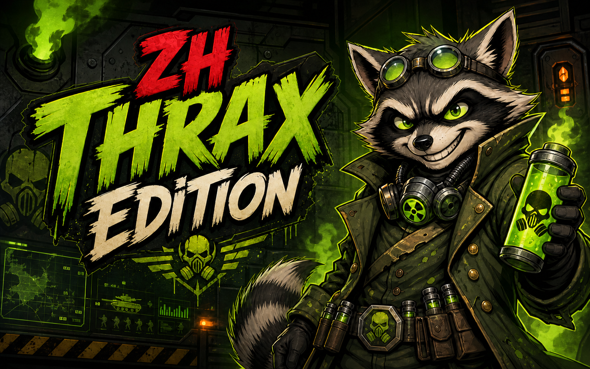



  

# GeneralsOnlineZH: Dr. Thrax Edition

**Zero Hour client mod for skirmish and challenge maps: user-controllable AI allies, fixed Air Force General scripts, higher render FPS, a modernized radar/minimap, better camera controls, and rendering/performance fixes.**

Personal C&C Generals: Zero Hour client mod. It started as a skirmish/challenge build and is published to see if anyone wants it maintained in public.

Working title: Dr. Thrax Edition. The executable is still `GeneralsOnlineZH.exe`.

Download: [latest release](https://github.com/philb12312/GeneralsZH_Thrax_Edition/releases/latest)

This is a replacement `.exe` for Zero Hour. It is for skirmish, challenge maps, testing, replays, and maybe LAN if every player uses the same build.

This fork had two goals:

1. Make gameplay feel more modern while keeping Zero Hour recognizable. That means higher render FPS from the large performance pass, farther zoom-out, a cleaner radar/minimap, better camera controls, borderless fullscreen, graphics settings that stay set, and many rendering/visual fixes.
2. Fix the bugs that kept annoying us. That means passive allied bots, broken challenge-map triggers, Granger scripts checking the wrong objects, the blocky low-res radar, random quality drops, tree-shadow/render-state issues, and smaller problems from normal play.

Where that shows up in a match:

- Comp-stomp is more active because allied bots can be directed through chat instead of doing their own thing.
- The Granger challenge can run the Air Force object/script path it was built around.
- Big bases and multi-front fights are easier to play because you can zoom out farther and the renderer is not capped at 30 FPS.
- The minimap is cleaner and less blocky, with blips, pings, resources, buildings, shroud/fog, and hero markers adapted to the higher resolution.
- Visuals stay stable during busy fights instead of silently dropping effects after a short FPS dip.
- Old visual bugs, such as broken tree shadows and the teal-building flash, are fixed instead of accepted as engine weirdness.

This is not the live GeneralsOnline client. Do not use this for online play. The fork is older than the live client, and this build changes things that are not fair or sync-safe online: FPS cap, camera height, AI behavior, map scripts, and rendering. If you want normal online play, use [GeneralsOnline](https://github.com/GeneralsOnlineDevelopmentTeam).

## code line

This repo is downstream of [GeneralsOnlineDevelopmentTeam/GameClient](https://github.com/GeneralsOnlineDevelopmentTeam/GameClient).

The chain is:

1. [electronicarts/CnC_Generals_Zero_Hour](https://github.com/electronicarts/CnC_Generals_Zero_Hour)
2. [TheSuperHackers/GeneralsGameCode](https://github.com/TheSuperHackers/GeneralsGameCode)
3. [GeneralsOnlineDevelopmentTeam/GameClient](https://github.com/GeneralsOnlineDevelopmentTeam/GameClient)
4. this repo

TheSuperHackers and GeneralsOnline did the hard part. This repo is an experimental gameplay/client fork on top.

## install

1. Install Command & Conquer: Generals - Zero Hour.
2. Use patch 1.04. Steam already does this.
3. Download `GeneralsOnlineZH.exe` from the [latest release](https://github.com/philb12312/GeneralsZH_Thrax_Edition/releases/latest).
4. Put it in the Zero Hour install folder, next to `generals.exe` / `game.dat`.
5. Run `GeneralsOnlineZH.exe`.

It does not replace your saves, replays, maps, or mods.

## what changes during a match

This list is from the commits since the old base commit, not from memory. Big stuff first.

### allied skirmish AI is now something you can direct

The biggest gameplay change is allied AI control. In stock Zero Hour, an allied bot is mostly a separate player that happens to be on your team. You can hope it attacks the right flank, but you cannot point it at a problem. This build lets you give allied skirmish bots map orders through normal chat.

This changes comp-stomp and team skirmish. If Green is wasting troops at home, tell it to move right. If you need pressure on the top side of the map, tell the bot to move top right. If Red is the enemy who needs attention, send the bot toward Red. The bot moves actual combat teams, not one random unit at a time.

Documented command:

- `[optional bot color] move [place]`

Examples:

- `move center`
- `move top right`
- `move red`
- `green move right`
- `green move top right`

How targeting works:

- Leave the color out and allied bots can respond.
- Put the bot color first if you want one bot only: `green move top right`.
- Places can be map directions: `top`, `bottom`, `left`, `right`, `north`, `south`, `center`, `middle`, and combinations like `bottom left`.
- Places can also be player colors: `move red` sends the bot toward Red's base area.
- `come here`, `meet`, `rally`, and `regroup` use the same move path toward your base/position.

Under the hood, the bot collects combat teams, sends them as teams, holds the destination, puts units on guard, refreshes the order if they stall, and ignores missiles/projectiles so the command code does not try to steer weapon objects.

There is more parser code for attack/help/status/ping/stop, but this README only promises `move`. That is the command path I am comfortable documenting as a release feature.

### Granger finally uses the Air Force General script

The Air Force challenge map checks for normal USA objects in places where Granger uses Air Force objects. A script that waits for `AmericaPowerPlant` will not fire when the map has `AirF_AmericaPowerPlant`. The same kind of mismatch existed across power, bases, defenses, aircraft, upgrades, and general powers.

That means the vanilla map can fail to run parts of the fight it was trying to run. In this build the map is patched automatically at engine startup. You do not download a replacement map or edit files by hand.

Fixed examples:

- normal-USA object checks changed to Air Force equivalents, such as `AmericaPowerPlant` to `AirF_AmericaPowerPlant`
- Strategy Center, Barracks, Supply Center, Airfield, Patriot, and power-plant checks corrected for Air Force objects
- MOAB/Spectre science mixup fixed, so the script grants the intended MOAB instead of the wrong Spectre entry
- A10 and Carpet Bomb science names corrected to Air Force versions where needed
- power-plant upgrade and control-rod checks fixed
- Stealth Comanche upgrade logic repaired
- base-expansion and defense build logic repaired
- AirGen build-list replacement counts fixed, including extra power-plant logic

With the patch, the Granger challenge uses the Air Force object/script path it was originally built around.

### higher render FPS and measured performance work

Original Zero Hour has a hard 30 FPS render cap. This build lifts the render cap and reads your monitor refresh rate at startup. The game logic still has old Zero Hour timing rules, but the renderer is no longer chained to 30.

On modern displays, camera movement, scrolling, particles, and big fights can render above the old cap instead of being forced through the original 30 FPS limit.

The commits include:

- monitor refresh detection
- FPS cap setup through the normal game/network startup path instead of a hard-coded 30
- a fixed limiter after later profiling changes disturbed it
- particle-system frustum culling, so off-camera particles stop wasting frame time
- transparent sorting renderer batching for consecutive draws with matching render state
- frame, renderer, pathfinding, particle, terrain, shadow, and draw-call profiling logs
- benchmark mode that loads a save, runs for 30 seconds, and writes perf logs to the Zero Hour install folder

The branch also has benchmark/profiling output, so performance changes can be compared between save-based runs.

### radar/minimap no longer looks blocky

The radar now uses a 1024x1024 surface instead of the original 512x512 one. The minimap no longer has the same blocky, low-resolution look.

The mechanics around it were updated too. Blips, buildings, resource markers, shroud/fog, pings, the hero reticle, and right-mouse camera movement were adjusted for the higher resolution instead of leaving 512-era behavior stretched over a larger texture.

- Unit blips are resized for the new resolution instead of becoming tiny dots.
- Buildings draw as structure markers, separate from unit blips.
- Supply docks and oil derricks get resource markers, so money spots stand out immediately.
- Shroud/fog texture handling was changed for the larger radar surface.
- Beacon pings and generic event markers scale with the new radar size.
- The hero reticle is doubled, so your hero is easier to see.
- Holding right mouse on the minimap moves the camera from the radar.
- Right mouse over the radar no longer gets stolen by normal edge-scroll logic.

The radar gives more useful information at a glance.

### the camera and controls waste less of your attention

The camera work keeps the original game feel, but gives you more room to play. You can zoom farther out, move the camera faster with the wheel, jump to your hero with F1, and use borderless fullscreen so alt-tab is less painful.

- Max camera height is raised.
- Draw region and far clip were adjusted so zoomed-out play does not lose terrain/objects as easily.
- Mouse wheel zoom is faster.
- F1 jumps to your hero.
- Borderless fullscreen was added, so alt-tab behaves better.
- Bottom-edge scroll room was increased so the command bar stops fighting camera movement.
- ESC can skip video/load/transition screens and the score screen.
- Scripted intro cameras keep control when missions/cutscenes need them.

Bigger bases, long-range units, air attacks, and multi-front fights are easier to manage because the viewport shows more of the battlefield.

### graphics settings stay yours, even when the game gets busy

Vanilla Zero Hour had a dynamic quality system that could silently lower effects after a short FPS dip. A busy battle, a heavy weapon effect, or one bad camera angle could drop shadows, heat distortion, or particle counts. Then it would wait for a longer stable period before restoring things, without telling you.

That behavior is gone. The game no longer randomly decides to downgrade visuals behind your back.

The LOD/downshift path is also disabled, so zooming out does not make objects disappear or swap down just because the camera is higher. This keeps the new camera range useful without cutting visual detail to make it work.

### rendering fixes preserve visual detail

The rendering fixes are meant to keep smoke, shadows, water, team color, and large weapon effects working during the same battle. Performance work should not mean turning the game ugly.

- Water transparency math was changed to look nicer. This was a visual pass, not a claim that original water was completely broken.
- Tree shadows were restored with depth-bias fixes.
- Tree rendering was split across batches so tree shadows do not collapse into bad draw calls.
- Prop/tree visibility and culling were changed for the bigger camera range.
- The teal-building flash is fixed. The electrical-ball effect could leave dirty light/render state behind; the next frame could tint every building teal through stale DirectX light state.
- Heightmap edge reads got bounds checks.
- Particles outside the camera frustum are skipped.

No visual downgrades are intentional. The intent is to keep smoke, shadows, water, team color, and large battle effects, not trade visual quality for speed.

### chat and money commands help allied play

- In-game chat is centered and raised so it is easier to read during a match.
- Player colors next to chat names are kept.
- Money transfer works through chat: `send red 1000` sends money to an allied red player, `sendme 1000` asks an allied bot for money.
- Money commands are swallowed instead of printed as normal chat.
- The color dropdown can show colors already taken by other players.
- Shared color slot normalization was added.

This is still not an online-compatible client. These bits are for skirmish, LAN/testing, and experiments, not the live lobby.

### benchmark, profiling, and cleanup work

- `benchmark.bat` launches the game in benchmark mode with a save file.
- Benchmark duration is 30 seconds.
- Perf logs are written to the Zero Hour install folder.
- AI pathfinding got retry diagnostics and guard/move reissue logging.
- Async pathfinding was tested, caused cliff/stuck regressions, then was disabled again to restore original path semantics.
- Auto-update check is disabled.
- x86 release builds use the internal zlib path.
- zlib `Byte` conflicts in stats export were fixed.
- CRC/debug logging work exists in the history, but this release is not claiming live GeneralsOnline compatibility.
- Local repo instructions, benchmark notes, feedback helper, and profiling notes were added for development work.

## license

GPL v3, matching [GeneralsOnlineDevelopmentTeam/GameClient](https://github.com/GeneralsOnlineDevelopmentTeam/GameClient), [TheSuperHackers/GeneralsGameCode](https://github.com/TheSuperHackers/GeneralsGameCode), and EA's original [CnC_Generals_Zero_Hour](https://github.com/electronicarts/CnC_Generals_Zero_Hour) source release.

The license file is GPL v3 plus EA's additional GPL section 7 terms. See [LICENSE.md](LICENSE.md).

EA has not endorsed this project. All trademarks belong to their owners.
